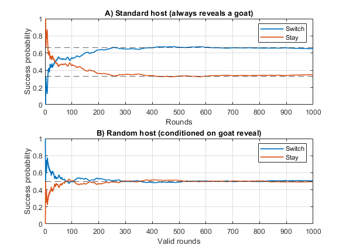

# Monty Hall — Why host policy matters

Small Monte Carlo simulation that shows two versions of the Monty Hall game:

1) **Standard host (textbook Monty Hall)**: the host always opens a door with a goat and then offers a switch.
    In this case, the host’s behaviour is informative (he avoids the car). Switching wins with probability **2/3**; staying wins with **1/3**.

3) **Random host (conditioned on a goat reveal)**: the host randomly opens one of the other two doors.
    In this case, the goat reveal happened only by chance. Switching and staying both win with probability **1/2**.

**How we obtained the information** (host policy) determines the correct inference.



## Quick start
Just run `monty_hall_demo`.

The script plots the running (cumulative) success rates.
<br><br>
## Note:

By Bayes' theorem, the conditional probability formulas are the same, but since the randomized host is not guaranteed to reveal a goat $(\mathrm{P}(\text{goat reveal} \mid \text{car not behind your door})$ and $\mathrm{P}(\text{goat reveal})$ are not $1)$ the probabilities shift:

**1) In case of the standard host:**

```math
\begin{aligned}
&\mathrm{P}(\text{goat reveal} \mid \text{car not behind your door}) = 1 \\
&\mathrm{P}(\text{car not behind your door}) = \frac{2}{3} \\
&\mathrm{P}(\text{goat reveal}) = 1 \\
\\
&\mathrm{P}(\text{car not behind your door} \mid \text{goat reveal}) = \frac{\mathrm{P}(\text{goat reveal} \mid \text{car not behind your door}) \cdot \mathrm{P}(\text{car not behind your door})}{\mathrm{P}(\text{goat reveal})} = \frac{1 \cdot (2/3)}{1} = \frac{2}{3}
\end{aligned}
```
<br>

**2) In case of the random host:**

```math
\begin{aligned}
&\mathrm{P}(\text{goat reveal} \mid \text{car not behind your door}) = \frac{1}{2} \\
&\mathrm{P}(\text{car not behind your door}) = \frac{2}{3} \\
&\mathrm{P}(\text{goat reveal}) = \frac{2}{3} \\
\\
&\mathrm{P}(\text{car not behind your door} \mid \text{goat reveal}) = \frac{\mathrm{P}(\text{goat reveal} \mid \text{car not behind your door}) \cdot \mathrm{P}(\text{car not behind your door})}{\mathrm{P}(\text{goat reveal})} = \frac{(1/2) \cdot (2/3)}{(2/3)} = \frac{1}{2}
\end{aligned}
```
